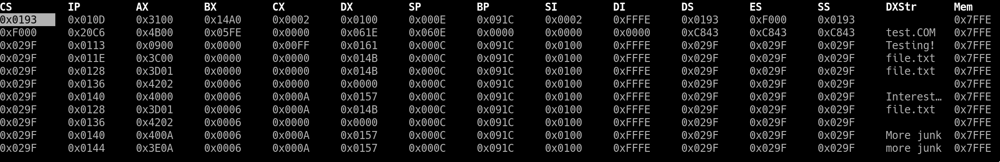

# IntLog
Interrupt logging for 16-bit DOS programs

IntLog monitors and logs BIOS and DOS interrupts for debugging 16-bit DOS programs.  IntLog will hook into the requested interrupt as a TSR, and then record all calls made to a tab-delimited file, noting the calling address, all register values, a particular followed memory location, and any strings pointed to by the DX register (useful for DOS functions).

Usage
--
```
INTLOG <int:2> <dump seg:4> <dump off:4> <dump size:2> <filename>
```
Note, all values must be given as capitalized hex digits.  The number of digits are indicated per field in the usage message. Int represents the interrupt to monitor, dump represents the segment, offset, and size of memory to watch, and filename is the file to log results to.

IntLog can be compiled using MASM for DOS.

Output
--

